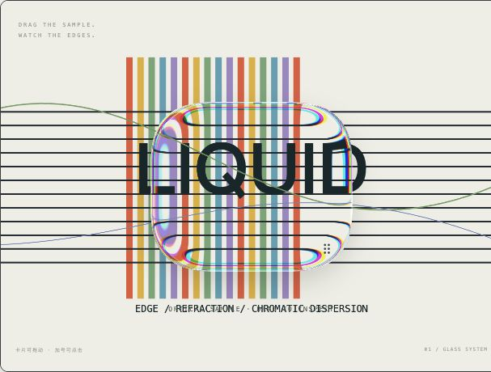
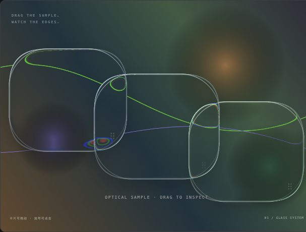

# Liquid Glass

> **[简体中文 README →](README.zh-CN.md)**

A glass material library and interactive lab for the web. Explore clear refraction, frosted surfaces and layered glass while keeping text, buttons and inputs in the DOM.

**[Live demo](https://palering.github.io/liquid-glass/?lang=en) · [Performance lab](https://palering.github.io/liquid-glass/benchmark.html?lang=en) · [React example](https://palering.github.io/liquid-glass/react-smoke.html?lang=en)**



*Clear preset · WebGPU · light optical scene.*



*Clear preset · WebGPU · layered materials over a dark gradient. Both images are screenshots of the running lab.*

## Features

- Framework-independent core, an optional React 19 adapter and TypeScript declarations.
- WebGPU first, with WebGL2 → SVG → CSS → solid fallback on initialization failure or device/context loss.
- Seven material presets, 20 optical controls, tint, blur and adjustable clarity.
- Light and dark themes, built-in scenes, sample images and local image upload.
- Named presets with JSON import/export; draggable surfaces and native DOM interaction.
- One shared renderer per controller, reusable blur resources and static redraw on change.

## Run locally

Requires Node.js 22 and npm.

```sh
npm ci --cache .local/npm-cache
npm run dev
```

Open [localhost:4174](http://127.0.0.1:4174/). The lab runs independently of any adjacent project. See [development](docs/development.md) for builds, checks and local package installation.

## Use the core

The package is **not published on npm**. Build it from this repository and install the local tarball in your consuming app before using these imports.

```js
import { GlassController } from '@workspace/liquid-glass';
import '@workspace/liquid-glass/styles.css';

const glass = new GlassController(stage, {
  backend: 'auto', capture: 'scene', theme: 'light', background: 'testchart'
});
const unregister = glass.register(cardElement, { kind: 'card', radius: 22 });
await glass.ready;
await glass.setSettings({ controls: { blurPx: 0, thickness: 30 } });
// On unmount: unregister(); glass.dispose();
```

Give `stage` the `lg-stage` class and an explicit size; wrap foreground content in `lg-content`. Layout remains the app's responsibility. React bindings are available through `@workspace/liquid-glass/react`. See the [API reference](docs/api.md) for settings, lifecycle, presets and React usage.

## Current scope

GPU and SVG renderers sample the library's own scenes and supplied images. They do not automatically capture arbitrary page DOM. Native HTML-in-Canvas is experimental and unavailable in the browser used for the current validation. SVG approximates displacement; CSS provides blur; their output differs from GPU optics.

This is an experimental library. Cross-browser coverage, React Flow integration, DPR 2 stress testing and long-term stability remain unverified. See [current status](docs/status.md) and [performance evidence](docs/performance.md) for measured results and limits.

## Documentation

[API](docs/api.md) · [Development](docs/development.md) · [Deployment](docs/deployment.md) · [All documentation](docs/README.md)

## License and credits

The project-wide license is pending; the package remains `private` / `UNLICENSED`. Public source access does not grant an open-source license. The adapted [Liquid Glass Studio](https://github.com/iyinchao/liquid-glass-studio) shaders retain their MIT license and attribution in [NOTICE.md](NOTICE.md) and [vendor/studio/LICENSE](vendor/studio/LICENSE).
