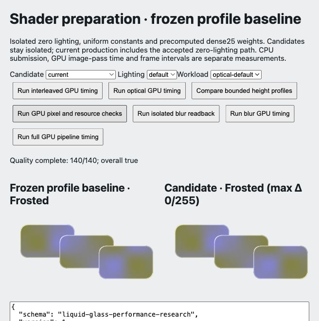
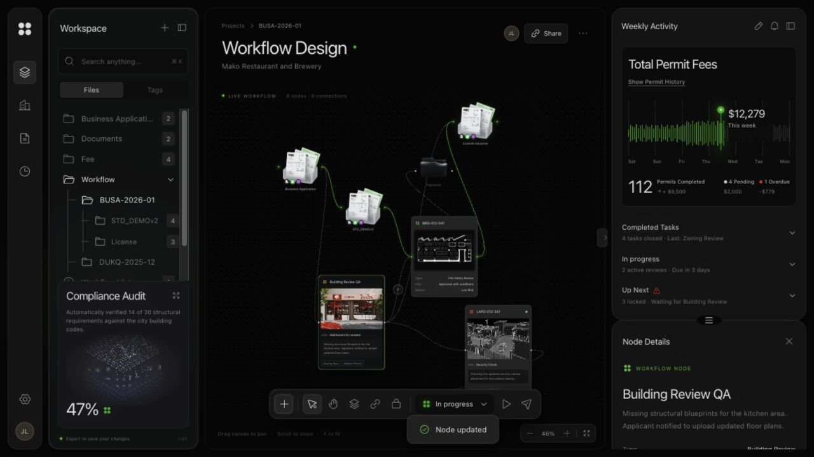

# Shader preparation acceptance archive

Audience: public

2026-10-07, Chromium154, local only. [Analysis and decisions](../../../docs/shader-preparation.md), [TS migration contract](../../../docs/ts-migration-plan.md).

- [checks.json](checks.json): completed production gates and limits; runtime is still JS.
- [current-source.json](current-source.json): recoverable text source checkpoint, predecessor c54d8b1d181309ab76fea17820583d6ee9e66744d943bf264cc8c3ac908d656f. Binary assets remain in the checkout; this is not a Git commit. Verify each file hash before restoring selectively into a separate checkout.
- [summary.json](summary.json): statistics recomputed from raw samples. Independent timing and interleaved timing are separate protocols.
- [candidate-provenance.json](candidate-provenance.json): compiler source/binary and generated outputs; earlier result objects retain the exact provenance available when measured.
- [current-quality.json](current-quality.json): 140 cases against the old profile baseline; alpha exact, RGB max 1/255. TS compares exactly against the new frozen baseline.
- [contracts.json](contracts.json), [stability.json](stability.json), [chrome-smoke.json](chrome-smoke.json): final strategy, recovery/cleanup and interaction gates.
- [consumer-matrix.json](consumer-matrix.json), [consumer-production.json](consumer-production.json): 20 geometry cases and real production drag/connect/edit/reset/mobile checks.
- Height profile contracts check only alpha, nonblank and cleanup. Gallery images are actual GPU output; they do not establish old-look equivalence or production acceptance.
- [manifest.json](manifest.json): SHA-256 for every archive file except itself. Earlier stage archives remain unchanged.

Rebuild isolated candidates with `node scripts/prepare-shader-preparation.mjs`, then use `tests/browser/shader-preparation.html`. Do not overwrite this archive with later measurements. Other browsers/WebView, native DOM capture and long-term production stability remain outside current acceptance. No push, deploy or npm publication.

