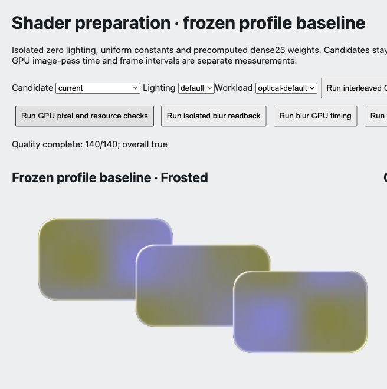

# TypeScript stage one acceptance

Audience: public

2026-10-07, local Chromium154. [Stage report](../../../docs/ts-migration-stage1.md), [next steps](../../../docs/ts-migration-plan.md).

[checks.json](checks.json) records strict types, 31 tests, frozen-JS value/JSON/accessor/error parity, build and actual package checks. [quality.json](quality.json) retains 140 raw readback cases; every currentHash matches the pre-TS [JS reference](../shader-preparation/current-quality.json). [contracts.json](contracts.json) records 30 actual backend policy cases and final cleanup. [manifest.json](manifest.json) contains the SHA-256 of each archive file except itself. Source recovery uses local Git commit checkpoints; earlier archives are unchanged.

This is the first six-module migration, not complete TS migration or production stability. Other browsers, WebView and long-term/device-memory acceptance remain outside this stage. No push, deploy or npm publication.

