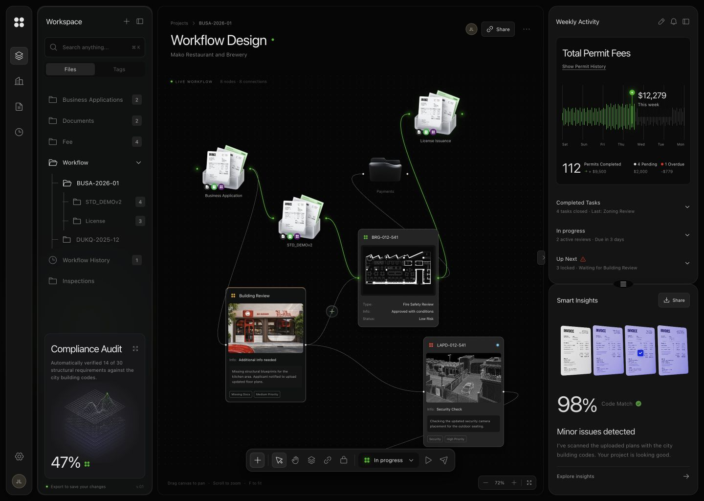
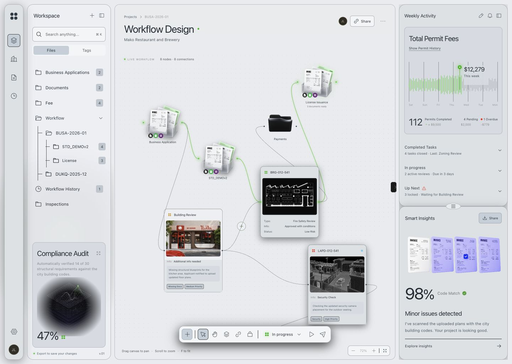

# Consumer geometry and GPU experiments

Audience: public

2026-10-06。本轮完成已授权的本地消费接入、几何测量、GPU 数值检查、资源复用、shader 快路径和局部模糊试验。**未推送、未部署、未发布 npm。** 原生 DOM 采集、Safari/Firefox/真实手机、GPU 时间与长期运行仍未验证。本轮已完成不等于整个路线图或生产稳定性已通过。

## 保留的实现

相邻 React Flow 原型通过本地 `file:` 包消费共享库；生产构建走 ESM package exports，开发使用源代码 alias 并 dedupe React。建筑卡片、连接加号和工作区侧栏注册到同一个 controller/GPU canvas；其余审核节点与右栏保留原实现。文字、照片、端口、边和业务交互仍是 React DOM/SVG，没有移入 shader。

核心新增 `setGeometryProvider`、`setScenePainter`、`invalidateScene`，接口与单位见 [API](api.md)。图模型供给每帧屏幕 CSS bounds，ResizeObserver 提供未取整尺寸；仅在注册/resize 等布局变化时重测 stage/flow 偏移。缺失、无效、抛错或属性 getter 抛错的快照整帧回到 DOM 测量。绘制回调失败清空部分画面、使用内置场景并报告原因，不触发 GPU 降级。它们独立于可序列化 Settings。

消费者自行绘制随视口移动的黑/灰白点阵与侧栏环境色。GPU/SVG 折射这些像素，不取样节点照片、正文或 SVG 连线。窄屏侧栏在共享材质外增加局部 CSS 背景遮罩/模糊，处理图节点前景与抽屉的遮挡；它不新增 GPU DOM 采集。设置中提供全局后端、深浅主题与材质开关。基础库仍保留三类材质、Studio 光学、GPU 降采样低通、多半径复用和五层降级。

## 模型几何的测量

[54 组原始结果](../benchmarks/results/geometry/performance.json) 和 [汇总](../benchmarks/results/geometry/summary.json)：同一份当前 controller，对照 live DOM / complete provided snapshot，SVG/WebGPU/solid，10/50/100 表面，3 次交替重复，960×540 / DPR 1、8 帧预热、30 帧取样，无 profiler 包装。全部状态与实际 geometryMode 匹配。

| 后端 / 数量 | CPU p95，DOM → provided (ms) | rAF p95，DOM → provided (ms) |
| --- | --- | --- |
| SVG / 10 | 9.60 → 0.30 | 17.50 → 17.50 |
| SVG / 50 | 24.80 → 0.70 | 33.30 → 17.20 |
| SVG / 100 | 38.80 → 1.30 | 50.00 → 49.80 |
| WebGPU / 50 | 12.10 → 0.50 | 17.40 → 17.40 |
| WebGPU / 100 | 35.10 → 1.00 | 33.60 → 33.40 |
| solid / 100 | 34.10 → 0.50 | 34.10 → 34.20 |

减少同步测量大幅缩短 **render 内 CPU 提交**，浏览器仍会在后续阶段执行布局与呈现；100 表面的帧间隔改善远小于 CPU 数值变化，不能宣称性能提高几十倍或已经 60 FPS。该表采样早于 GPU 缓存/快路径，不混用不同源码；hash 与协议见 [manifest](../benchmarks/results/geometry/manifest.json)。

实际消费者的五后端 × 0.2/0.85/1/2 缩放共 20 组：provided render 内 stage bounds 读取为 0，输入 DOM 身份、值与焦点保留，所有坐标差异 <0.05 CSS px。原始记录见 [matrix](../benchmarks/results/consumer/matrix.json)。拖动、物理端口连接、编辑、新增、搜索、插入拆边、删除/注销、锁定、材质开关、实际 device/context loss 和 SVG/CSS 模拟失效逐层回退均通过。[交互](../benchmarks/results/consumer/interactions.json) / [生产消费](../benchmarks/results/consumer/production.json)。

390×844 深浅主题无横向溢出，抽屉可点击，搜索定位后收起并注销面板表面；窄屏 ResizeObserver 坐标也在上述阈值内。[深色](../benchmarks/results/consumer/mobile.json) / [浅色](../benchmarks/results/consumer/mobile-light.json)。这是桌面 Chromium 的尺寸模拟。

## 双 GPU 数值检查与资源

[84 个同后端像素案例](../benchmarks/results/gpu-resources/quality.json)：Clear/Frosted/Reading、程序条纹/渐变/确定性高频 image 像素、DPR 1/2；另含薄/越界/零尺寸、0 色散/0 blur/极端参数、0.2/0.85/2 缩放、奇数尺寸 resize、source/radius 更新、layered 切换与注销。这里的 image 是固定生成的 Canvas 像素，不是截图或真实外部照片。

WebGL `readPixels` 翻转行；WebGPU 配置测试专用 COPY_SRC，并在**同一提交、同一呈现纹理**后附加 texture→buffer copy，随后 map；BGRA 转为 RGBA。生产 renderer 没有加入 readback。比较的是透明画布原始 premultiplied RGBA，不包含 DOM/CSS rim 与 shadow。

固定基线 8cdf48d → 当前：78/84 完全相同，剩余案例颜色最大差值 1/255，所有 alpha 完全相同，非零表面均非空。跨 WebGPU/WebGL 的 42 组 alpha 同样一致，但颜色最大差值 15/255，整图逐通道平均差值最大约 0.041（字节单位）；原本独立 WGSL/GLSL 的浮点、导数、纹理取样差异仍存在。本轮没有强行统一算法或宣称两后端逐像素等价。

WebGPU 复用每 surface 的 bind group、uniform ArrayBuffer、纹理 view；blur/blit pass 按 buffer 缓存输入/pipeline 绑定。纹理、pipeline、buffer 变化时重新绑定，注销/不可见/resize/半径失效及 dispose 清理；WeakMap 不持有已释放资源的强键。WebGL 缓存 attribute location。

30 帧 / 3 表面稳定移动：WebGPU bind group 90→0、view 210→30（每帧呈现纹理仍要新 view），WebGL attribute query 90→0；纹理与 GPU buffer 创建均为 0。空 surface 后 uniform/group/blur 项为 0。[分配及失效](../benchmarks/results/gpu-resources/quality.json)。

[12 组无 readback 性能对照](../benchmarks/results/gpu-resources/performance.json)：100 个模型 bounds、480×280 / DPR 1、静态背景、3 次重复。WebGPU CPU 均值 0.53→0.24 ms / p95 0.70→0.40 ms，rAF p95 17.60→17.70 ms。WebGL CPU 均值 1.40→1.39 ms / p95 3.00→3.20 ms，rAF p95 17.70→18.60 ms；不能声称 WebGL 吞吐提升。对照包含缓存和快路径，未隔离各自时延，也未测 GPU timestamp。

## Shader 快路径与 ROI 决定

vendor 固定 MIT 原件未改。适配模块对 WGSL/GLSL 都增加 uniform 零色散及精确 mix 端点分支：0 色散 + 全 blur 只需 1 次纹理读取，0 色散 + 混合需 2 次，非零色散 + 全 blur 需 3 次；一般情况保留原 6 次逐通道取样。仅判断 `mixRate == 0/1`，不钳制原有区间外外推。数值阈值如上；保留的是等价范围内的工作减少，不宣称已有独立 GPU 时间收益。

局部模糊候选只在测试 fixture 包装 draw，依据折射距离/折射率/色散外扩，并包含 12 tap 和整个降采样支持。**仍使用全尺寸纹理**，不是裁切图集或显存优化；WebGPU clear 也未局部化。DPR 1/2、1/3/20 表面、blur 3/9/20，共 [36 组](../benchmarks/results/gpu-resources/roi.json) RGBA 完全一致。保守 margin 为 195–581 物理像素，计算覆盖范围 14.8%–96%。

[24 组动态背景性能](../benchmarks/results/gpu-resources/roi-performance.json) 没有稳定帧收益；WebGL / 1 表面 CPU 均值 2.48→3.05 ms，rAF p95 17.50→17.80 ms；WebGPU / 20 表面 rAF p95 17.50→18.10 ms。**不启用生产 ROI**；保留可复现实验，避免用裁切面积推断实际速度。未来只有 GPU 时间/实际瓶颈与可靠通用采样界限支持时才重新推进。

## 收尾与复跑

[四实例 DPR 2 / 600 帧](../benchmarks/results/gpu-resources/stress.json)（两个 WebGPU、两个 WebGL，每实例 50 表面，每 10 帧重绘背景）：注册/buffer/group ≤50，blur 半径 ≤3，模式和后端保持；所有实例释放后 surface/listener/canvas/buffer/group/blur 项为 0。约十秒前台 rAF，不是长期 soak、驱动显存或真实移动设备证明。场景回调失败恢复与最终几何 getter 异常回退均通过。

16 个 Node 契约、TypeScript 消费、库/实验室构建、离线 tarball/no-DOM import/React SSR 通过。消费方生产构建和 Sites 路由/打包 4/4 通过，保留托管文件；其 JS 738.83 kB / gzip 224.74 kB，仍有 500 kB chunk 提示。生产页面确认 WebGPU/provided/3 surfaces/1 GPU canvas、端口连接、图片加载、深浅主题和全局切换，QA 文案/面板从 bundle 移除。

复跑：先 `node scripts/prepare-optimization-baseline.mjs 8cdf48d`，`npm run dev`；`/tests/browser/optimization.html` → Run geometry performance；`/tests/browser/gpu-quality.html` → quality / resource performance / ROI / ROI performance / DPR 2 stress。运行性能时保持前台和固定 viewport，不混入截图/readback/资源包装或 HMR。消费者用 `?glassQA=1` 的开发入口跑矩阵；生产没有该入口。各 archive 的 manifest 记录不同阶段 source/fixture hash，旧 147 组和前两轮原始记录保持历史身份。
