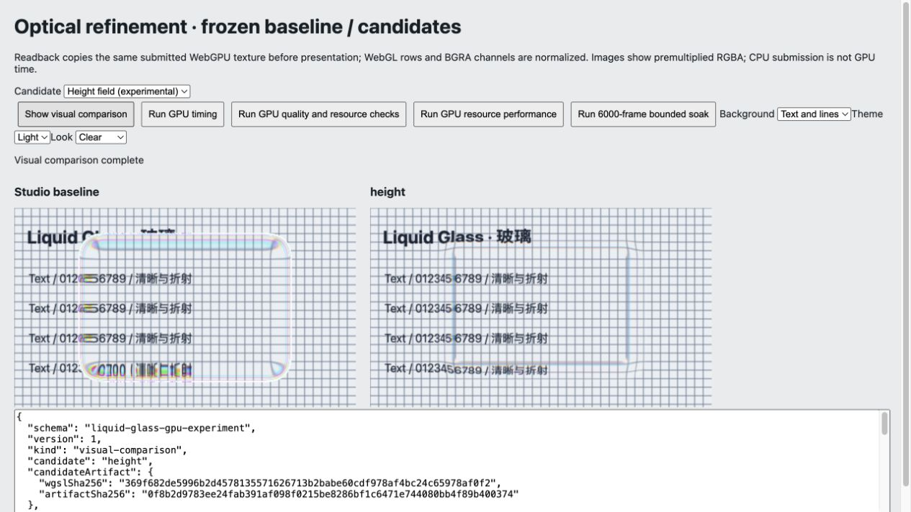
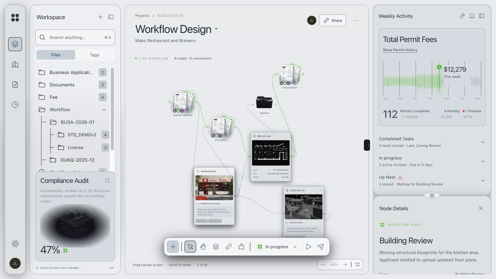

# 光学试验、Chrome 基线与 TS 入口

Audience: public

2026-10-06。本阶段完成于本地，运行时仍是 JS，尚未开始 TS 迁移。用户明确要求先处理 Chrome/Chromium，其他浏览器和平台兼容留到后续 WebView 支持阶段。没有增加兼容层，也没有推送、部署或 npm 发布。当前迁移入口见 [TS 计划](ts-migration-plan.md)；限定场景的检查通过不等于生产稳定。

## 基线与来源

冻结 WGSL 单源码阶段的核心指纹 `e5d574cc22f21762df39fbd2a795259915c9382d5016a19c446bf342ae635d25`，最终核心指纹 `bc2a5ad508a4350aac24d05a9c3519188573ee974398a39322f839ee46434bb7`。前者包含此前资源复用、模型几何和 WGSL 翻译工作，并非未经修改的 Studio 原版。原 vendor 文件与 MIT 声明保留；[上游复核](shader-quality-review.md) 和 [单源码报告](wgsl-single-source.md) 说明来源与已有改造。

本轮继续理解并检验三个项目的可借鉴结构：Studio 的边缘折射、色散与双向高光；LiquidDOM 的形状/梯度/高度 profile 分工；ybouane 的 bevel 高度和光线路径。后两个上游仍使用有限差分处理相关梯度，不能称它们已实现全解析法。高度场候选是本项目编写的 WGSL，借鉴模型思路，未复制它们的运行时代码；没有接入 DOM atlas、DOM capture 或完整布局框架。

[原始归档](../benchmarks/results/optical-refinement/) 包含每个试验的协议、环境、样本和 SHA-256 清单，E5 源码快照、最终 JS/声明/测试/工具/构建配置快照及候选源码/产物哈希。历史阶段归档保持不变。最终快照可作为开始 TS 前的可恢复检查点，后续迁移另建小步 Git 检查点。

## 试验与取舍

| 方案 | 实际检查 | 取舍 |
| --- | --- | --- |
| 全解析梯度 | 84 案例中 46 个满足颜色差 ≤1/255；38 个超阈值，最大颜色差 254，alpha 全部一致 | 不进入默认实现；有限差分在角部/分支附近的行为不同，数学导数正确不等于已有像素契约相同 |
| 保守混合梯度 | 84/84 满足颜色差 ≤1/255、alpha 一致；有独立 GPU timestamp 样本 | 性能收益不稳定，保留实验；避免默认增加分支复杂度 |
| 高度场与 Snell 折射 | 84/84 通过掩膜、非空、资源与清理检查，alpha 一致；颜色最大差 255 | 是刻意改变视觉的模型，不按像素等价验收；实验保留，未新增公开 model 设置 |
| 有界五次幂 | 冻结候选及最终生产实现均为 84/84 RGBA 完全一致；64 组中性参数/range 校准通过 | 保留数值保护；不声称它有稳定性能收益 |

解析梯度对 pinned p-norm 距离场求导，并保留上游 normal 幅度与像素尺度，不直接换成单位法线。纯函数测试覆盖分支外导数、微小圆角、有限值和尺度。混合版本在角部/接缝/轴线附近使用原差分，在局部线性区域使用解析值。

高度场用三次 Hermite profile，中心高度 0.5×bevel、两端斜率为零、最大斜率 0.75；由高度梯度构造 3D 法线，使用单段 Snell 折射、Schlick Fresnel 和一个 Blinn–Phong 方向高光。ray 的横向偏移按 CSS 高度与实验艺术增益映射到纹理。它未模拟完整双界面或能量守恒，也未保留所有 Studio hardness/range/opposite 控制语义。实际文字/线条图更平缓，亮边和边缘扭曲较弱；更适合作为独立材质进一步设计，不能直接替换现有 look。

[暗色照片](../benchmarks/results/optical-refinement/height-photo-dark.jpg) 和 [Reading 照片](../benchmarks/results/optical-refinement/height-photo-reading.jpg) 也保留实际截图；它们来自测试场景，不是生成效果图。

## 保留的生产变化

`positiveFifth` 先将输入夹到 0…1，再用乘法计算五次幂，替换高光中的两个 `clamp(pow(base, 5), 0, 1)`。负底数不属于可依赖的跨着色语言 pow 域，参见 [WGSL pow](https://www.w3.org/TR/WGSL/#pow) 与 [GLSL ES 3.00 规范](https://registry.khronos.org/OpenGL/specs/es/3.0/GLSL_ES_Specification_3.00.pdf)。本轮 Chromium 没有复现基线黑像素故障；中性校准中基线和候选都与背景完全一致。这是明确输入域的保护，不能把理论风险写成已经观察到的故障。

Controller 构造和 `setSettings` 增加内部部分参数校验：非法选项、布尔类型或非有限值在 DOM、设置及图片请求 generation 变化前拒绝，有效数值按既有范围夹取，未知字段剔除。校验保持 partial merge，不注入 look 的绝对默认值，保留按 surface kind 的材质与旧相对控制。接口细节见 [API](api.md)。源码 JSON shader 导入增加标准 import attribute，以支持 Node ESM 直接导入；浏览器和打包无 DOM/SSR 路径均通过。

四个作者 shader 仍仅维护 WGSL，GLSL 与 uniform packing 自动生成。WebGPU/WebGL 资源代码仍分别存在；这次没有把 TS、光学实验或兼容策略混在一起。

## 性能证据与边界

GPU timestamp 仅计主光学 pass：960×560 物理像素、DPR 2、12 个表面，blur=0、非 layered，预热 10 帧、40 样本×3 次×2 版本。测试设备明确请求 timestamp-query，并确认每帧只有一个目标 pass。原始值观察到 0.065536 ms 的量化步长，短 pass 与运行负载存在噪声。合并 120 个原始样本，用 nearest-rank 计算，不平均各次 percentile：

| GPU 主光学 pass | mean / p50 / p95 / p99 / max（ms） |
| --- | --- |
| 混合梯度试验基线 | 0.4041 / 0.3277 / 1.4418 / 1.9661 / 2.6214 |
| 混合梯度候选 | 0.4129 / 0.2621 / 1.1796 / 1.7695 / 3.4079 |
| 最终数值保护对照基线 | 0.7176 / 0.3277 / 2.3593 / 3.1457 / 3.8666 |
| 最终数值保护实现 | 0.7373 / 0.3277 / 2.3593 / 2.5559 / 4.2598 |

混合梯度前三次中的前两次 mean 更慢、最后一次更快，不据此提升为默认优化。两组试验分别执行，不能拿它们的基线互相比速度。最终有界实现的统计同样不支持整体变快结论。

资源性能协议为 480×280 CSS、DPR 1、100 表面、30 预热/90 样本×3 重复×两个 API×两个版本，共 12 组有效；CPU 提交与 rAF 分开归档。270 样本合并 CPU mean/p95/p99：WebGPU 0.4085/0.6/0.9 → 0.3907/0.6/0.8 ms；WebGL 2.0226/3.8/28.6 → 1.9722/5.1/11.5 ms。WebGL p95 增加，不能仅引用 p99 下降宣称稳定改善。稳定表面绑定/缓冲/模糊资源没有新增增长，30 帧计数与注销清理通过；这不是驱动显存测量。

## 最终回归

- Node 25/25、TypeScript 声明消费与 shader 漂移检查通过；新增导数/高度/Snell 和部分设置的原子校验测试。
- 最终两个 GPU API 共 84/84 案例与冻结基线 RGBA 精确相同，含 Clear/Frosted/Reading、薄表面、边界参数、DPR 1/2、缩放、resize、layered 与清理。
- Chrome 五后端×深浅主题 10/10 smoke 通过：强制后端实际命中，输入身份/值/焦点保留，非法更新不产生部分状态改变，最终清理为零。
- 真实 React Flow 消费矩阵 20/20 通过；生产 WebGL 连接 8→9、建筑节点拖动与深浅主题保留，最后重置8节点/8连接，图片完整，无横向溢出，无 warning/error，生产未含开发 QA。
- 库/实验室构建、13 文件 tarball 的核心导入与 React SSR 通过；消费构建与 Sites 4/4 通过。最终消费 JS 708.94 kB / gzip 217.88 kB，仍有 500 kB chunk 提示。
- 四实例（WebGPU/WebGL 各两个）、DPR 2、每实例50表面、18,000前台帧限定运行通过；每1,000帧切换尺寸与0/9/18/35模糊半径，每500帧采样，共144条资源检查。后端和模型几何保持，场景回调失败/恢复通过，四实例最终 surfaces/listeners/canvases/buffers/groups/blur cache 全部为零；无 warning/error。该协议约5分钟，不能替代生产长期运行或驱动显存检查。

原生 DOM 采集、任意 DOM 折射、hydration、真实移动设备、其他浏览器、WebView、驱动显存和生产生命周期尚无本阶段验收。按用户范围，这些独立事项不阻塞开始 TS 重构。下一阶段保持本次 API、像素、坐标、资源和包边界，按 [TS 计划](ts-migration-plan.md) 小步迁移；不同时引入新的光学模型或浏览器策略。
