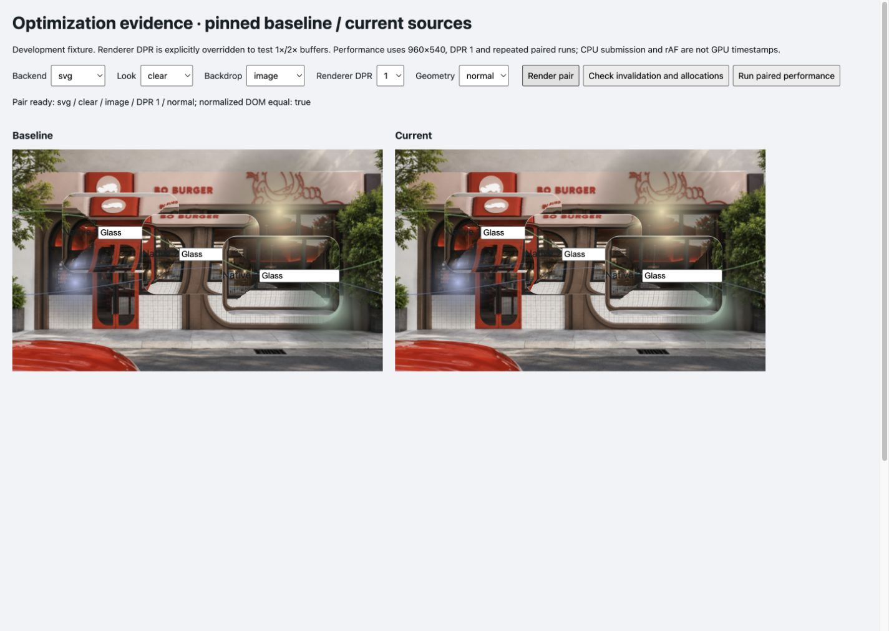

# 第一轮优化实验：保留光学，减少 SVG 重复工作

Audience: public

2026-10-06。先复核三个固定项目及本库调用链，再建立修改前/后的独立 fixture，最后试验 SVG 位移图与节点缓存。源码理解、优缺点和公式假设见 [shader-quality-review.md](shader-quality-review.md)。本轮只修改本库 SVG renderer；没有安装或改写另外两个项目的运行时。

## 区别不止 DOM

| 项目 | 值得保留的优点 | 本库的取舍 |
| --- | --- | --- |
| Studio | WGSL/GLSL 两种后端、分阶段光学调试、折射/色散/边缘高光独立参数 | 保留现有光学和参数响应；先补质量基线，避免优化时改变外观 |
| Liquid DOM | renderer 与内容源分离，DOM paint 同步、内容图集、纹理分桶、自适应模糊；形状融合与高度/斜率场 | 保留采集与渲染独立的架构；局部处理和光学模型分开试验，原生 API 可用性单独验收 |
| ybouane | 静态快照缓存、异步去重、字体复用、媒体直接绘制、局部输入和一个共享 WebGL context；倒角/圆顶/多方向高光 | 借鉴不随位置变化的数据复用思路；保留真实前景 DOM 与共享 renderer，先减少重复工作 |

DOM 能力是背景像素获取与内容合成的一部分。后两个项目还改变了光学模型、形状处理和资源组织；不是给 Studio 增加一个 DOM 接口就得到的同等实现。

## 各项目值得尝试的方向

以下是固定源码观察支持的候选，并非上游已验证缺陷或性能排名。

- **Studio / 本库光学适配：** 构造法线退化、薄表面和参数边界的双后端对照，检查 WGSL 的归一化防护与 GLSL 差异；再试零色散合并通道采样、只读需要的 sharp/blurred 纹理和最终绘制专用分支。先记录像素差异，再测 GPU 时间，不以减少源码行数或采样表达式直接承诺提速。
- **Liquid DOM：** 在资源身份稳定时评估 bind group 复用，拆分几何/斜率场变化与内容 paint 变化，检查背景更新是否必须重算全部场；局部 blur 与渐进上采样要带折射和模糊外扩。保留内容图集、纹理分桶及形状融合，分别测 pass 数、分配和边缘质量。实验采集 API 应封装版本适配与失败原因。
- **ybouane：** 给精确尺寸 FBO 池评估容量预算、LRU 或尺寸分桶，并保留实际 viewport/UV，避免桶尺寸改变采样。检查 resize、连续内容变化和卸载期间的在途异步快照是否可能迟到，必要时加代次校验；保留静态缓存、去重和字体过滤。单独测 WebGL 输出到逐元素 2D canvas 的复制成本，再决定合成路线。上述竞态和资源增长尚未运行验证，不能称为已发现泄漏或错误。
- **本库公共层：** 将 bounds 读取、样式写入、排序和通知分开测量；批量读取后写入，缓存不变样式。GPU 与 solid 的高密度长尾说明该方向值得检查，尚不能确定每项所占比例。

## 已实现的尝试

旧 SVG 路径每次 render、每个表面重新计算 80×80 位移图并重建 filter/image/tint 子树。位移图只由本地宽、高、有效圆角、厚度决定；移动位置、背景或染色不改变它。

当前按这四个输入缓存位移图，相同形状共享；每个表面保留 SVG 子树，仅更新变化的属性。背景仍按 scene version 更新，位置独立更新；尺寸、圆角和厚度变化会重新求图。每帧结束删除未使用形状，注销删除表面节点，dispose 清空缓存。位移公式、80×80 分辨率、GPU shader、模糊实现、DOM 前景和降级优先级保持现有行为。

这是对本库原有代码的优化；没有将上游 capture 或 renderer 整段复制进来。

## 正确性证据

固定基线 `8f6b9ffece2c6a0d7227f8de6ca3b115b64e51c7`，当前源码 hash 与 fixture hash 见 [manifest.json](../benchmarks/results/svg-cache/manifest.json)。

- 20 组 SVG：clear/frosted/reading × testchart/gradient/image × 1×/2×，另含薄表面与不同宽度。每组 3 个表面，60 份 SVG 子树独立栅格化，RGBA 差异通道为 0、最大差为 0，且输出非空；归一化后 DOM 属性和位移图相同。两侧使用同一份背景像素，隔离独立 Canvas 2D 生成时观察到的 1 色阶波动。[像素 hash 与设置](../benchmarks/results/svg-cache/quality.json)
- 另外 10 组检查 WebGPU/WebGL 的清透/磨砂及 1×/2×，CSS/solid 能正常进入 requested backend；这是渲染状态和截图 smoke 检查，没有证明两种 GPU shader 像素等价。
- 三个相同表面移动 12 次：旧版创建位移 canvas 36 次，当前为 0；当前共享 1 张图、复用 3 个 SVG 子树。尺寸/厚度/圆角/背景变化正确更新，输入值和焦点在移动后保留；注销后 0 个材质层、当前 0 个形状缓存，dispose 后无 fixture 子节点。[生命周期检查](../benchmarks/results/svg-cache/checks.json)

独立 SVG 栅格化未覆盖整页 CSS 裁切、文字抗锯齿或浏览器合成；完整页面另以实际截图检查。1×/2× 是 fixture 显式设置的 renderer 分辨率，不是两台真实设备验收。

## 成对性能

固定 960×540、DPR 1、Studio look、浅色 testchart、10/50/100 个移动小表面。8 帧预热、30 帧采样、3 次重复，轮换 baseline/current 顺序；SVG/WebGPU/solid 共 54 组。每个后端/数量/版本合并 90 个样本，使用 nearest-rank p50/p95，不剔除长尾。后端降级、标签隐藏、视口改变或 fixture 出界视为失败。

单位 ms；54 / 54 有效，0 组失败。

| 后端 / 表面数 | CPU p50：旧 → 新 | CPU p95：旧 → 新 | rAF p95：旧 → 新 |
| --- | ---: | ---: | ---: |
| svg / 10 | 13.60 → 2.60 | 17.00 → 5.10 | 17.50 → 17.60 |
| svg / 50 | 57.00 → 13.30 | 64.50 → 20.20 | 67.60 → 17.60 |
| svg / 100 | 109.20 → 31.70 | 140.10 → 44.90 | 149.80 → 50.30 |
| webgpu / 10 | 0.90 → 0.80 | 3.30 → 1.20 | 17.60 → 17.60 |
| webgpu / 50 | 5.70 → 5.90 | 9.00 → 8.90 | 17.60 → 17.70 |
| webgpu / 100 | 22.60 → 19.00 | 35.00 → 28.60 | 34.40 → 33.60 |
| solid / 10 | 1.20 → 0.60 | 3.50 → 3.00 | 17.40 → 17.50 |
| solid / 50 | 5.80 → 5.50 | 9.00 → 8.70 | 17.60 → 17.30 |
| solid / 100 | 23.30 → 20.80 | 37.30 → 35.90 | 34.20 → 50.00 |

原始 [performance.json](../benchmarks/results/svg-cache/performance.json) 保留所有 CPU/rAF 样本与每次统计，[summary.json](../benchmarks/results/svg-cache/summary.json) 保留合并结果。WebGPU 和 solid 是未改光学的对照组；波动不应解释为 GPU 算法收益。100 个表面仍有公共 DOM/布局与绘制成本，不能承诺 60 fps。

这是一轮开发源码成对实验，协议与原先 12 帧预热/60 帧采样的 147 组生产归档不同，不能混合样本或直接对比绝对数字。CPU 包含 transform、controller、bounds、样式和提交，不含异步 GPU 执行；rAF 不是实际呈现 FPS。设备温度、其他系统负载、长期显存和跨浏览器未受控或未测。

## 复跑与继续点

1. `node scripts/prepare-optimization-baseline.mjs 8f6b9ff`；只导出本仓库固定 src/vendor 到被忽略的本地目录，不执行上游脚本。
2. 启动 `npm run dev`，打开开发服务的 `/tests/browser/optimization.html`，视口至少能完整容纳 960×540 fixture，本轮为 1440×1024。
3. Render pair 选择质量组合；Check invalidation and allocations 检查共享、失效及清理；Run paired performance 运行成对矩阵。记录页内 Evidence JSON，保持标签可见，不改变窗口。
4. 核对 baseline revision、core source hash、fixture hash、分辨率和样本条件后，才解释改动收益。测试 fixture 不进入库包或 Pages 构建。

SVG 缓存已通过这轮实测，保留在实现中。公共 bounds/样式 profiler 与条件样式缓存试验已完成，后者收益不稳定而撤回，见 [第二轮实验](shared-update-experiment.md)。继续真实消费方 pan/zoom/输入/端口与读写调度验收；随后单独试 GPU 快路径与局部 blur。高度场、融合、多灯光和 DOM 采集仍是候选，不能靠新增参数或 TS 改名算作完成。
