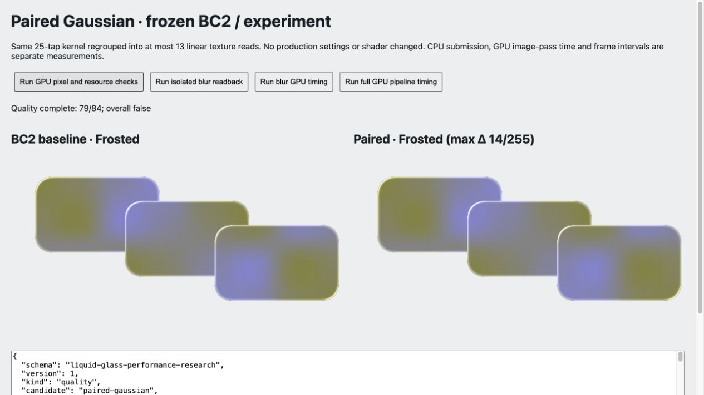

# Shader 深入对照与实现取舍

Audience: public

2026-10-06。本轮重新逐函数阅读三方固定 shader、形状/颜色库和相关图像 pass，并完成独立数学检查及双 GPU 实验。结论是保留已有模型作为兼容基线，同时建立独立的形状、表面轮廓、光学和性能策略。Studio 提供了一个可用起点，不应限制后续模型。本文的 shader 候选增强尚未成为运行时设置；后续已独立接入的手动 [性能档位](performance-profiles.md) 沿用 dense25，实施结果见 [验收](performance-profile-implementation.md)。

English overview: the three pinned projects contain distinct shader models, not merely different DOM adapters. Keep the current Studio-derived appearance as a compatibility baseline; evaluate profile-based optics and budget policies independently. The paired Gaussian experiment reduces texture reads but fails the existing final-image fidelity gate and has mixed timing results.

## 研究边界与来源

| 项目 / 固定 revision | 阅读范围 | 原始代码入口 |
| --- | --- | --- |
| Liquid Glass Studio / `f7b28c36305a862f5cffed3ddd51511cf1204f56` | WGSL/GLSL 主片元、SDF/math/color、背景模糊；与本库适配对照 | [原主 WGSL](https://github.com/iyinchao/liquid-glass-studio/blob/f7b28c36305a862f5cffed3ddd51511cf1204f56/src/shaders-wgsl/fragment-main.wgsl)、[保留来源与许可](../vendor/studio/UPSTREAM.md) |
| Liquid DOM / `dd342ab663d718e8b4edf4cd39983b9a873360a7` | WGSL shared/prepass/main/blur、adaptive blur、renderer/core 与内容同步 | [shaders.ts](https://github.com/AndrewPrifer/liquid-dom/blob/dd342ab663d718e8b4edf4cd39983b9a873360a7/packages/core/src/shaders.ts)、[adaptive-blur.ts](https://github.com/AndrewPrifer/liquid-dom/blob/dd342ab663d718e8b4edf4cd39983b9a873360a7/packages/core/src/renderer/adaptive-blur.ts) |
| ybouane/liquidglass / `59af227103795f06421a96e2c7d3dceb081decd2` | GLSL 形状/高度/折射/灯光、renderer、snapshot 与调度 | [shaders.ts](https://github.com/ybouane/liquidglass/blob/59af227103795f06421a96e2c7d3dceb081decd2/src/shaders.ts)、[GlassRenderer.ts](https://github.com/ybouane/liquidglass/blob/59af227103795f06421a96e2c7d3dceb081decd2/src/GlassRenderer.ts) |

本地第二、第三项目的 13 个参考文件已按字节数和 SHA-256 重新核对；公开 [来源清单](../benchmarks/results/shader-performance-research/upstream-sources.json) 只保存 revision/URL/hash，不分发额外上游源码。Studio 原件未修改。源码分析针对这些固定版本；没有运行三方同场景基准，没有据此给项目质量或速度排名。

## 三者真正不同在哪里

| 维度 | Studio | Liquid DOM | ybouane |
| --- | --- | --- | --- |
| 形状 | p-norm 圆角 SDF、演示形状平滑合并 | 多形状 SDF sample，距离/梯度/重叠面积；保守融合及法线门控 | 单圆角矩形 SDF |
| 法线/轮廓 | 4 次邻域距离差分；梯度幅度参与位移和高光 | 单形状仍用有限差分；融合传播梯度；凸/凹/混合高度轮廓；斜率场预绘制并模糊 | 半圆倒角高度，4 个相邻高度差分，再归一化为 3D 法线 |
| 折射 | 边缘深度→入射/透射角→经验 UV 位移；中心基本平坦 | 斜率重建法线，按 RGB IOR 算折射方向，用高度转换位移；内容可用独立深度/IOR | 梯度驱动的双面位移近似，附加中心拉动；另一模式为圆顶 UV 放大 |
| 亮边/高光 | 距离与方向的艺术控制；LCH 亮度调色 | 屏幕导数抗锯齿与细 rim；法线驱动反射/高光 | 多个固定方向的 Blinn-Phong 高光、内描边及 glow |
| 背景/内容 | 背景纹理，原演示非 DOM 内容系统 | 原生 DOM 纹理与内容图集，也支持核心纹理输入 | HTML snapshot、字体/图像缓存、共享 WebGL 后再复制到元素 canvas |
| 主要额外成本 | 距离差分、角度/幂、逐片元颜色转换 | 形状遍历、斜率场及过滤 pass、内容遍历/纹理、融合 | 高度差分、多灯光/噪声、快照及最终 canvas 复制 |

后两者都有不同的光学模型。DOM 能力是另一条轴；没有 DOM capture 也可以评估它们的几何/光学思想。功能数量、注释中的 physically-based 和截图观感都不能替代质量/成本验收。

## Studio：为什么当前模型有特点，也为什么不能随意“简化”

主 shader 将归一化 SDF 转为 CSS 内部深度 `d`。令厚度为 `T`、折射率为 `n`，边缘参数可写为 `x=1-d/T`，入射角由 `asin(x²)` 给出，透射角为 `asin(sin(θi)/n)`，位移尺度使用两角差的正切。再乘距离场差分梯度、距离控制和坐标换算；深度超过厚度的区域走平坦分支。这是一个可调的屏幕空间折射模型，没有显式求解两次表面交点。

`getNormal` 的结果经过固定放大，不是单位三维法线；其长度还调节 Fresnel/glare。p-norm 圆角近似距离也不保证每处单位梯度。把差分直接换成解析单位法线，会同时改变位移、方向与亮边，而不仅是减少四次 SDF。此前全解析候选超像素阈值，混合候选收益不稳定，见 [光学试验](optical-refinement.md)。后续新模型应明确区分距离梯度、归一化边缘方向和真实表面斜率，不让一个变量承担三种语义。

原背景采样通常分别读取 sharp/blur 的 RGB，共 6 次。本库已有零色散和 mix 端点分支，可落到 1/2/3/6 次；该变化已验收。把非零色散从 5 调到 1 并不减少 RGB 读取数。将高光强度调小也不保证省掉 LCH 转换。目前 `SRGB_TO_LCH` / `LCH_TO_SRGB` 涉及颜色空间转换与非线性运算，即使控制设为零也缺少完整的跳过路径。

可优先检验的保真改动：把只依赖 uniform 的 tint→LCH、范围平方、方向常量等移到材质准备阶段；用完整回归检查 CPU/f32 舍入；精确零高光时跳过对应计算。颜色简化到 RGB 或线性 RGB 应作为另一个允许近似的模式，不能无说明改变旧 look。现有有界五次幂和输入校验仍保留。

## Liquid DOM：值得吸收的是分解方法

`SdfSample` 同时携带距离、梯度与 submerged-area 估计。融合限制在有限带，按法线关系约束平滑，并用重叠面积影响范围；混合权重传播梯度后再规范化。这比无条件把所有形状粘在一起更可控，但 prepass/main 对 shapeCount 的遍历需要空间裁剪和数量预算。形状融合改变材质连通关系，应是明确功能，不能在自动降档时悄悄关闭。

高度轮廓把 `t` 定义为倒角外缘 0 到内部 1。凸轮廓近似 `sqrt(1-(1-t)^4)`；凹轮廓取互补值，混合轮廓还正确包含“混合权重的导数 × 高度差”。其实现对根号设置下限，再限制最大斜率，避免边缘无穷大。下限附近的导数是稳定化斜率约定，不能当成截断高度函数的严格微分。特别应保留有界处理而不是机械照搬极陡边缘。

斜率场先按 fill weight 加权再过滤，主 pass 恢复斜率、重建法线，背景和内容仍可采用不同 IOR/深度。这使形状计算有机会在几何不变时复用，但新增纹理、预绘制和过滤可能使少量小面板更慢。缓存失效必须覆盖 bounds、缩放、圆角、轮廓、融合邻居、DPR；光源变化可以独立于几何。若试用 RGBA16float，逻辑每 texel 是 8 字节；格式/过滤/跨 API 路径需单独验收，不能直接套用当前 RGBA8 的预算。

`fwidth` 与梯度校正用于 mask/rim，可以研究在不同 DPR、zoom 和近似 SDF 下保持稳定细边。需要观察尖角/薄表面及导数调用所在控制流，不能把抗锯齿公式直接塞进任意分支。

其模糊把 13 个高斯 tap 合并成 7 次线性读取，并分层降采样、逐层上采样。优点是减少读取并明确恢复分辨率；额外上采样 pass 也有成本。本库目前两个 blur 输出留在低分辨率，由主材质线性采样，改成逐层上采样不是纯粹“补齐”优化。它以参数缩放采样间隔；相邻 tap 合并的严格恒等条件不自动适用于任意非整数 texel 间距，应按近似滤波验收。

## ybouane：保留可控轮廓和照明，不继承物理标签

倒角高度使用半圆截面：在归一化倒角内，`h(t)=sqrt(t(2-t))`，边缘陡、内部渐平。shader 用固定 2 个物理像素的高度差分重建法线；与 CSS 长度/DPR 一起使用时需检验跨分辨率一致性。双面模式通过高度梯度和厚度的经验组合得到位移，另加固定系数的中心拉动；没有完整的入射点、第二交点和出射方向求解。圆顶模式的 UV 收缩是放大效果，有独立用途，应与折射强度解耦。

多方向高光让轮廓可辨，适合研究可配置的主光/填充光。固定四路照明和高幂指数不应全档常开；对半向量常量预计算、选一盏主光、限制 HDR/alpha、独立验收光源旋转是更稳妥的组织方式。微扰可能在拖动和低 DPR 时闪烁；需要频率限制及静态种子，不能以“纹理更多”作为增强依据。

其 snapshot 缓存和媒体路径属于采集/调度研究；不能因当前 Chrome 原生 DOM API 未开放就自动加入整页逐帧快照。共享 context 值得保留，本库已采用共享 renderer；末端向元素 2D canvas 复制需要另外测成本。

## 自行推导：新轮廓为何应独立设计

[数学脚本](../experiments/performance/analyze.mjs) 对照了此前本库实验的半高 Hermite 轮廓与半圆、四次根号轮廓。Hermite 是 `h=.5t²(3-2t)`，斜率 `3t(1-t)`：外缘高度与斜率都为零，最大斜率在中段为 .75；半圆和凸根号的外缘很陡。**因此此前高度场试验偏柔的边缘有公式依据，不能用它一次试验的观感否定所有高度模型。** 这是结构分析，仍需新样片验证。

建议新模型显式定义倒角宽度、轮廓族、最大斜率和背景/内容深度，并按实际高度缩放导数。比较时固定最大位移、边缘宽度和亮度，再检验形变/可读性；不要把同名 slider 数字当成等价校准。兼容模型继续承载旧 look，新模型独立命名，不要求通过旧模型逐像素等价门槛，但必须通过坐标、alpha、输入边界和视觉验收。

## 独立实验：成对高斯采样

依据线性插值，权重为 `a,b` 的相邻 texel 可以在 `i+b/(a+b)` 的位置取一次样本，再乘 `a+b`。我们对自有 25-tap 高斯核重排，中心 + 六对对称样本，单方向最多 13 次读取；横纵 pass、降采样、缓存和 32-byte ABI 保留。候选 [WGSL](../experiments/performance/image-paired.wgsl) 只进入隔离 fixture，经同一 Naga 生成 GLSL；没有换入生产。

CPU 检查覆盖 5 种信号、6 种 sigma、两种间距、31 个位置。单位 texel 间距的最大误差约 `1.05e-15`；把间距改为 .75 时最大误差约 .213（0..1 信号）。这证实适用条件，不能把数学恒等泛化到任意缩放核。实现还处理小 sigma 下成对权重下溢，避免 0/0。

实际 Chromium 154 下两 GPU 后端的隔离纹理 54/54 达到 RGBA 最大差 ≤1/255，包含高频背景、透明输入、奇数尺寸和 1×17 退化宽度；alpha 最大差也是 1。完整材质三轮均只有 79/84 达到原门槛，5 个案例超标，最高 14/255，完整材质 alpha 精确。**纹理检查通过没有带来最终材质保真通过。** 最终差异与后续非线性颜色/高光放大相容，但没有进一步逐项关闭运算来证明唯一原因。

GPU timestamp 分别测 image passes 和真实 renderer 全部 render passes。每半径/variant 3 次重复、每次预热10+采样40，轮换顺序；scene960×540、DPR1，强制每帧 blur。完整管线另每帧上传静态测试图，单大面板900×480；不包含 controller/DOM 几何及 scene 绘制。下表为120样本合并的 GPU mean / p95，单位 ms：

| 工作负载 / CSS blur radius | BC2 | 合并采样 |
| --- | ---: | ---: |
| blur only / .5 | 1.212 / 2.228 | .960 / 1.966 |
| blur only / 3 | 1.342 / 2.621 | .980 / 2.032 |
| blur only / 18 | 1.479 / 3.801 | 1.678 / 4.391 |
| 全 render passes / .5 | 2.502 / 4.981 | 1.518 / 3.342 |
| 全 render passes / 3 | 2.278 / 4.063 | 2.086 / 4.719 |
| 全 render passes / 18 | 2.090 / 5.243 | 1.838 / 4.850 |

原始每次结果、CPU提交、rAF、长尾、哈希与环境在 [归档](../benchmarks/results/shader-performance-research/README.md)。时间为 render-pass 区间之和，排除上传/复制与 pass 间隙；每帧 query resolve/map 会同步等待，rAF 不是普通应用 FPS。该设备 timestamp 存在量化，系统温度/负载未受控，不含 WebGL GPU 计时。18px blur-only 反而变慢，完整3px p95变差，部分 repeat 方向不同；即使 .5px 有收益，也不支持全半径/硬件稳定提速。候选还保留每片元12次权重 `exp`，增加成对位置计算，读取减半不等于总工作减半。

结论：不替换默认 dense25。候选可继续检验权重预计算并作为近似档备选；近似档需独立视觉门槛和实际总体收益，不能因为放宽阈值就自动接纳。

## 更宽的优化方向与实施优先级

| 候选 | 保留的长处 / 新思路 | 风险与进入条件 |
| --- | --- | --- |
| uniform 常量预计算、零光照分支 | 保留 Studio 颜色及旧 look，减少重复 ALU | CPU/f32差异；先完整84案例，再独立GPU计时 |
| CPU生成高斯权重或乘法递推 | 在 dense/paired核中减少逐像素 `exp` | uniform ABI/packing、精度与尾权重；独立试验，不与模型升级打包 |
| 显式半圆/凸/凹轮廓及受限灯光 | 吸收后两者轮廓/法线可解释性，保留低成本 inline 路线 | 校准最大位移、亮度、薄边；新视觉门槛 |
| 按几何缓存斜率 prepass | 吸收 Liquid DOM 分离几何与材质 | 新纹理/pass可能抵消收益；比较1大面板与100小卡，严格失效 |
| 形状候选裁剪/融合邻域 | 减少所有像素遍历全部 shape | 邻域需含融合外扩；融合是功能开关，单独验收 |
| blur 半径预算/局部图集 | 复用同半径，限制近似档的独立半径；探索 atlas 尺寸桶 | 边缘外扩与最大折射位移；先前ROI无稳定收益，不能直接复活 |
| 限制 attachment 往返与层复制 | 保留共享context/缓存，降低带宽 | 不破坏叠层顺序/透明；计时必须包含copy，而非仅render pass |

[NVIDIA GPU Gems 3 Chapter40](https://developer.nvidia.com/gpugems/gpugems3/part-vi-gpu-computing/chapter-40-incremental-computation-gaussian) 给出高斯权重递推。我们可用首项1、初始比值 `q=exp(-1/(2σ²))`，每项权重乘当前比值，比值再乘 `q²`；或按 radius/DPR 在 CPU 一次准备。它是算法依据，不是本设备性能保证。[Chapter28](https://developer.nvidia.com/gpugems/gpugems3/part-iv-image-effects/chapter-28-practical-post-process-depth-field) 说明低分辨率和双线性组合滤波的用途；景深的允许误差不能直接移用到本库材质。

[Khronos 的 TBR 指南](https://docs.vulkan.org/guide/latest/tile_based_rendering_best_practices.html) 强调 attachment 与外部内存流量。由此推断应同时关注 pass/复制/面积，而不是只计 shader tap；Vulkan 的具体屏障/attachment API 不能直接移植到 WebGPU，也没有据此按厂商名自动分档。

2026-10-07追加：uniform/权重准备的单变量试验与有界轮廓对照已完成，生产只采用精确零光照跳过；新轮廓保持实验，完整取舍与数据见[Shader优化验收](shader-preparation.md)。手动预算已在追加 JS 阶段接入并单独验收。TS 按 [迁移入口](ts-migration-plan.md) 从新的性能阶段检查点保持行为，不把语言重构与新模型上线混成一次变更。当前 Chrome 范围、本地发布策略和旧 JS 冻结检查点保持。
