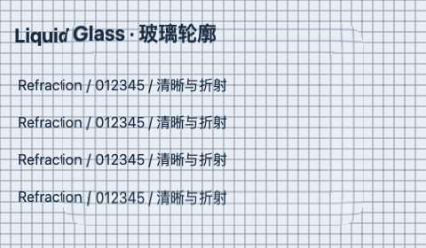
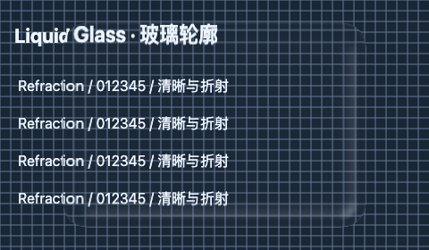

# Shader 优化取舍与 TS 冻结基线

Audience: public

2026-10-07。本阶段继续验证此前未完成的优先候选，而不是将“可以迁移 TS”解释成“Shader 已经最优”。生产只采用有明确适用条件、画质通过且交错计时有重复收益的零光照路径。其余候选保存源码与失败或收益不足的证据，不进入运行时。

English overview: production now skips Fresnel/glare work at exactly zero intensity. Five optimization candidates passed the expanded image gate, but uniform preparation and three Gaussian alternatives did not justify adoption. Three bounded height profiles remain isolated visual experiments. TS readiness means a recoverable, verified behavior baseline and resolved immediate experiments, not globally optimal shaders.

## 本轮改变了什么

作者源码仍为 [WGSL](../src/shaders/optics.wgsl)，GLSL/反射/packer 由锁定 Naga 自动生成。光学块仍160字节，图像块仍32字节；没有新增公开参数、性能档位或材质模型。默认核保留25 tap横纵高斯和原降采样金字塔。

当 `fresnelFactor === 0` 或 `glareFactor === 0` 时，分别跳过该项几何、高光与LCH颜色运算；非零值继续使用原计算，即使很小也不自动当成零。请求值仍由原API保存，档位不偷偷关闭光照。光学公式主体仍来自固定Studio模型，vendor原件与MIT声明保留。

该实现不移动CPU/GPU边界，也不增加GPU资源。最终生产GLSL与计时候选逐字节一致，反射布局也一致。对固定性能阶段JS基线的140个双GPU案例全部通过：134个RGBA精确相同，其余最大颜色差1/255，alpha全部精确；没有放宽既有≤1/255的优化门槛。TS语言迁移应与本轮新冻结基线精确比较，而非累积允许每步1/255漂移。

## 逐项验证与决定

| 候选 | 检查 | 最终决定 |
| --- | --- | --- |
| 精确零光照跳过 | 140/140图像，alpha精确；正常与零光照均有独立、交错GPU计时 | 进入生产；收益限定在关闭相应项时 |
| CPU/f32准备tint→LCH及范围平方 | 140/140图像；26个案例有≤1/255差异；光学ABI变为192字节；有界8项缓存 | 不采用：GPU mean .824→.831 ms，p95 1.475→1.556，CPU .0577→.0748 ms；没有稳定收益 |
| CPU准备dense25权重 | 140/140最终图像精确；126/126隔离纹理≤1/255；图像ABI变为96字节 | 不采用：完整管线18px mean 1.620→2.407 ms，p95 6.095→8.192；其他半径也不一致 |
| 固定索引展开CPU权重 | 140/140最终图像精确；交错完整管线计时 | 不采用：.5px几乎持平，3px/18px整体mean和p95增大 |
| GPU高斯乘法递推 | 140/140最终图像精确；126/126隔离纹理≤1/255；保留32字节ABI | 不采用：.5px三次mean/p95均增加；3px/18px方向不一致 |

不能仅凭少了`exp`或纹理读取认定更快。上述测量只支持本设备和所测负载的决定；无法唯一定位编译器、带宽或寄存器的原因。以后若目标硬件、分辨率或应用负载改变，可依据这些固定候选重新测量。

## 零光照的实际成本与边界

先保留3次独立短测的波动原始记录，再追加交错协议：两个持久设备/renderer在同一帧交替先后顺序，每个样本重复4次光学render，实际render-pass timestamp区间求和后除以4。每组预热10帧、40样本、3重复，共120样本；960×540 CSS、DPR2、12个220×164表面、厚度45px、blur0。CPU提交另记，不混入GPU时间。完整模糊管线以同样交错方式每样本2次render，半径.5/3/18px，DPR1。

| 主光学pass，合并120样本 | 基线mean / p95 ms | 零光照候选mean / p95 ms |
| --- | --- | --- |
| Fresnel和glare均关闭 | .871902 / 1.441792 | .592555 / 1.032192 |
| 正常开启 | 1.106193 / 1.556480 | 1.125854 / 1.556480 |

关闭两项时，mean约下降32%，三次重复各自的mean和p95均下降；CPU mean .07125→.06792 ms。正常开启的合并mean约增加1.8%，各次方向不一致，p95持平：这不是全局加速。单项关闭的画质已验证，没有单项独立速度结论。其他档位/场景的GPU收益不从此表外推。

Chromium154单设备、短窗口；没有受控温度/负载或多硬件证据。timestamp有量化，批量测量只是减少量化影响。区间排除上传/复制及pass间隙；query resolve/map会等待GPU，rAF不是正常应用FPS。没有WebGL GPU时间、驱动显存或耗电结论。第一次独立协议的波动没有删除，也不与后续交错协议混合统计。

## 其他项目的思想如何进入试验

沿用[固定来源研究](shader-design-research.md)的版本：LiquidDOM四次根号凸轮廓、ybouane半圆倒角，以及此前本项目Hermite。本轮由本项目编写三份有界WGSL，仍使用单段Snell折射和一个方向高光，没有移植上游runtime、DOM采集或完整双界面模型。

半圆轮廓高度为 `.5×bevel×sqrt(t(2−t))`；凸轮廓为 `.5×bevel×sqrt(1−(1−t)^4)`。根号分母下限.001，斜率上限4，边缘截断区采用明确的稳定化约定。数学脚本检查3轮廓×3 IOR×7位置共63个有限值/有界案例。以单位距离梯度、IOR1.45的10,001点最大位移校准，半圆/凸轮廓增益分别1.162096/0.717950，使它们与Hermite最大位移可比；不是与Studio同画质，也不是所有IOR统一校准。

三轮廓各140个案例通过alpha精确、非空和资源清理检查。它们刻意改变RGB，不能把这些通过数写成旧画面保真或视觉质量验收。实际深浅样片有更集中的边缘轮廓，当前目标位移较克制；仍缺完整参数语义、薄边/角部的视觉选择和生产模型API，所以不替换默认材质。其他项目已影响这些可运行的Shader试验；生产主光学仍保留兼容模型。

## 最终门槛与复跑

基线为性能档位阶段指纹`c54d8b1d181309ab76fea17820583d6ee9e66744d943bf264cc8c3ac908d656f`；本轮生产指纹`0243e339c688c8bcc7f2b762bc330efe370b34eaa3cb088052684c85e55299cd`。原[性能快照](../benchmarks/results/performance-profiles/current-source.json)保持不变；新的[可恢复快照](../benchmarks/results/shader-preparation/current-source.json)、原始样本与SHA清单见[归档](../benchmarks/results/shader-preparation/README.md)。源码指纹覆盖runtime/shader/benchmark；完整快照另外保存工具、声明、fixture与文档，不等同Git提交。

Node29、声明消费、四对shader漂移检查、库/Lab构建和实际tarball安装/无DOM导入/React SSR通过；最终打包13文件、40,153字节。最终双GPU140案例、30项性能策略、1350帧切档/失效恢复/零资源清理、Chrome五后端深浅10项通过。真实消费20组矩阵最大几何误差0.015625px，render内stage读取0，输入与焦点保留；矩阵需桌面搜索侧栏展开，首次关闭侧栏调用在采样前失败，展开后完整通过。生产WebGPU拖动、连线8→9、改名、重置8/8及390px深浅主题通过，图片完整、无横向溢出、DEV QA不可见。新增/插入/删除及逐级后端故障交互沿用上一阶段证据，本轮没有重写这些逻辑。消费生产构建716.38 kB JS /220.00 kB gzip，仍有原500 kB chunk提示；Sites打包测试4/4通过，未部署。

复跑顺序：`node scripts/prepare-shader-preparation.mjs`恢复固定实验副本（需要已有锁定Naga二进制，校验冻结源与编译器源码，并记录二进制hash）；`npm run build`核对生产生成文件；启动开发服务，打开`tests/browser/shader-preparation.html`，选择候选/`current`运行图像、隔离模糊、交错GPU计时或轮廓样片。新模型检查仅比较alpha/非空/清理，精确候选门槛固定RGB≤1/255、alpha0。性能策略与Chrome fixture见[档位验收](performance-profile-implementation.md)。候选源码位于`experiments/shader-preparation/`，不进入包或Lab生产入口。归档脚本为`scripts/archive-shader-preparation.mjs`：拒绝覆盖已验收目录，并校验当前源、实测产物和最终门槛；后续测量应另建阶段。

本轮优先候选的采用/拒绝已明确，生产接口和ABI稳定，回归有新冻结起点，因此可按[TS迁移计划](ts-migration-plan.md)进入语言迁移。新视觉模型、几何斜率prepass、融合/多灯光及硬件自动校准是独立功能迭代；它们没有被证明无价值，也不要求在语言重构前穷尽。其他浏览器/WebView、任意DOM采集、驱动显存和生产长期稳定仍保持未验收。运行时仍JS；本轮未推送、未部署、未发布npm。
