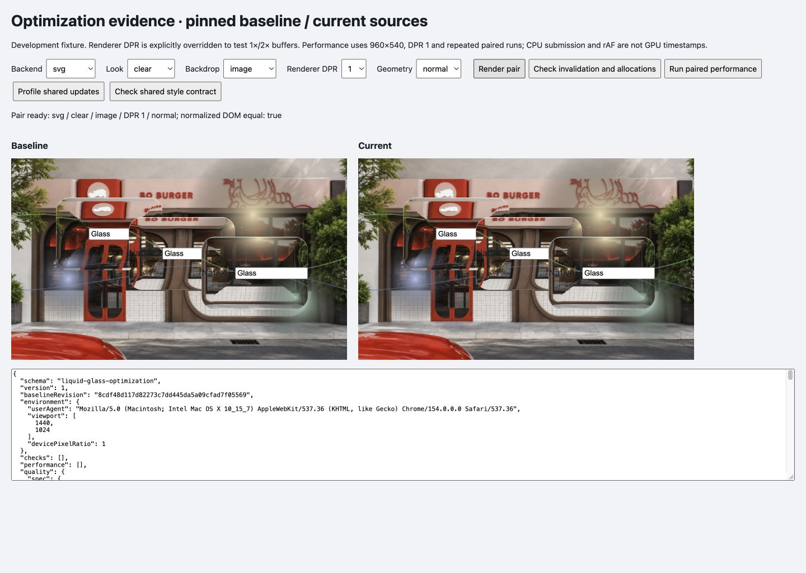

# 第二轮实验：公共更新成本与样式缓存取舍

Audience: public

2026-10-06。本轮在本地完成，未推送、未部署。上一轮 SVG 位移图/节点缓存仍保留。新增分段 profiler 和五后端交互契约检查；条件样式缓存试验因未显示稳定收益而撤回，**第二轮结束时**的 `src/` 与基线 `8cdf48d` 相同。后续实现与结果见 [第三轮记录](consumer-gpu-experiment.md)。不要把本轮候选性能当成当前库的性能归档。

## 测到了什么

Controller 原本已先读 stage 和所有 surface 的边界，再写材质样式。100 个移动表面的诊断中，每帧有 400 次显式 custom-property 调用，但实际 style attribute 变更只有 100 次，对应 fixture 的 transform 更新；静态强制 render 没有 style attribute 变更。重复设置相同值并没有制造等量的 DOM 变更。

下面是撤回候选后、当前源码的诊断均值，单位 ms，每项 30 帧。960×540、DPR 1、Studio look、浅色 testchart、100 个 82×38 表面，8 帧预热。包装器与 MutationObserver 会增加开销，因此只用于定位，不与无包装的性能表混合。

| 当前后端 | 移动：CPU / 第一次 bounds 读取 | 静态强制 render：CPU / 第一次 bounds 读取 |
| --- | ---: | ---: |
| solid | 24.36 / 23.80 | 1.19 / 0.017 |
| WebGPU | 23.63 / 22.83 | 1.49 / 0.013 |
| SVG | 29.23 / 23.64 | 1.25 / 0.023 |

第一次读取之后的 100 次 surface bounds 读取成本小得多。这个时间分布支持“transform 更新后，第一次几何读取承担待处理的浏览器样式/布局工作”的判断；**没有 compositor trace，不能证明这些时间全部属于 layout，更不能解释为 stage 几何运算本身需要 24 ms**。SVG 还有位置属性更新与滤镜提交成本，GPU 执行时间未测。

这里的 idle 为诊断工具主动每帧调用 render，隔离读取和写入成本；实际库的 idle scheduler 仍按 dirty 更新，不能把本表当成静态场景每帧必然提交的证据。[原始分段样本](../benchmarks/results/shared-updates/profile-retained.json)

## 试过什么，为什么撤回

候选实现为 controller 和 DOMRenderer 增加条件 CSS 写入：WeakMap 保存输入字符串与浏览器归一化值，每次核对当前 inline value 和 priority。不变值跳过写入；宿主改值、清空 cssText 或加入 `!important` 后恢复库控制的属性。颜色归一化、弱引用释放与宿主覆盖都纳入检查。

候选在稳定移动期间把显式样式调用降到 0，并通过五后端的基线样式/几何对照。但减少调用不等于减少实际布局或合成成本。无包装的成对测试显示收益不稳定，因此没有留下额外缓存和状态维护。[候选补丁](../benchmarks/results/shared-updates/candidate.patch)、[候选契约记录](../benchmarks/results/shared-updates/contract-candidate.json)、[候选诊断](../benchmarks/results/shared-updates/profile-candidate.json)

无包装协议：960×540、DPR 1、Studio、浅色 testchart，10/50/100 个移动表面；8 帧预热、30 帧采样、3 次重复，轮换 baseline/candidate 顺序，共 54 / 54 有效。每项合并 90 帧，nearest-rank，不删长尾。基线已包含上一轮 SVG 缓存。

| 后端 / 数量 | CPU p50：基线 → 候选 | CPU p95：基线 → 候选 | rAF p95：基线 → 候选 |
| --- | ---: | ---: | ---: |
| SVG / 10 | 3.20 → 2.60 | 6.60 → 8.60 | 17.30 → 17.60 |
| SVG / 50 | 14.10 → 14.60 | 20.10 → 26.50 | 33.40 → 34.30 |
| SVG / 100 | 29.50 → 27.50 | 37.10 → 37.30 | 50.10 → 50.10 |
| WebGPU / 10 | 1.20 → 0.60 | 3.50 → 3.00 | 17.50 → 17.50 |
| WebGPU / 50 | 6.10 → 6.40 | 8.90 → 8.90 | 17.60 → 17.60 |
| WebGPU / 100 | 21.80 → 19.50 | 35.70 → 35.50 | 34.40 → 49.50 |
| solid / 10 | 0.90 → 0.80 | 2.90 → 2.80 | 17.40 → 17.60 |
| solid / 50 | 6.90 → 6.10 | 9.00 → 8.90 | 17.50 → 17.50 |
| solid / 100 | 20.70 → 21.80 | 36.90 → 35.80 | 50.00 → 50.00 |

SVG 10/50 的 p95 更高，100 个表面的 CPU 长尾基本不变；部分中位数更低不足以证明稳定收益，也不能把一次波动断言为确定的回归。[全部性能样本](../benchmarks/results/shared-updates/performance.json)、[汇总](../benchmarks/results/shared-updates/summary.json)。温度、外部负载和长期状态未受控；CPU 提交与 rAF 都不是 GPU 时间或实际呈现 FPS。

## 最终保留与验证

保留开发 fixture 的 **Profile shared updates** 和 **Check shared style contract**。后者在 solid/CSS/SVG/WebGPU/WebGL 上检查 13 个状态：初始、移动、祖先平移缩放、尺寸/薄表面、主题材质阴影、宿主改值和 priority、cssText 清空、隐藏/显示、禁用/启用、stage resize、稳定移动。五后端全部通过，输入身份/值/焦点、后端、有效圆角、宿主样式修复和注销/dispose 均有独立断言。[最终契约记录](../benchmarks/results/shared-updates/contract-retained.json)

侧并排 stage 的零尺寸元素返回 viewport 零点，stage-relative 空表面原点不参与等价比较；缩放浮点 bounds 按 0.001 CSS px 比较。原始坐标保留，不改变 renderer。它验证 fixture 的 DOM/坐标契约，尚不是 React Flow 端口或真实消费应用的验收。

撤回后另检查 Clear / image / SVG / DPR 1，三个 SVG 子树输出非空且 RGBA 差异通道为 0，完整页面截图见下。不是新的 20 组像素矩阵，也不是 GPU shader 数值等价证明。[本轮像素记录](../benchmarks/results/shared-updates/quality-retained.json)

14 个 Node 契约测试、TypeScript 消费检查、生产/libraries 构建、打包导入与 React SSR 通过；实际浏览器无 error/warn。第二轮检查点源码 hash 与基线相同，候选 hash、补丁 hash、最终 fixture hash、采样时间和证据边界见 [manifest.json](../benchmarks/results/shared-updates/manifest.json)。最终 fixture 在候选测量后补充了 idle/环境守卫/独立断言；性能函数保持不变，单独记录其 hash。早期六组 profiler 保留为探索记录，不冒充最终完整守卫协议。

## 复跑与下一步

1. `node scripts/prepare-optimization-baseline.mjs 8cdf48d`，启动 `npm run dev`，打开 `/tests/browser/optimization.html`；本轮视口 1440×1024、DPR 1。
2. Profile shared updates 跑移动/静态 × 三后端 × 两版本，共 12 组；保持标签可见、不改变视口。Check shared style contract 跑五后端断言，Evidence JSON 为可保存结果。
3. 如需重试已撤回候选，在干净的隔离 checkout 中应用归档补丁，再跑 Run paired performance；不要在实际待保留源码上悄悄重新启用它。采样前核对 source hash 与 manifest。
4. 下一轮优先在真实消费方测试已有节点坐标能否供 renderer 使用，以及读/写帧调度。需要包含 stage 原点、pan/zoom、滚动、resize、DPR 和 DOM 命中；减少同步读取可能只把工作移到浏览器后续阶段，必须同时测 rAF 和交互。不会以可能过期的 bounds 缓存替代正确几何。

第二轮结束时 GPU 快路径、局部 blur、融合与原生 DOM 采集仍是独立候选；第三轮的前两项已有完成的保留/撤回决定。继续保留 Studio 的光学、共享 renderer、真实前景 DOM，以及已验证的 SVG 缓存。本阶段没有推送或更新线上 Pages。
