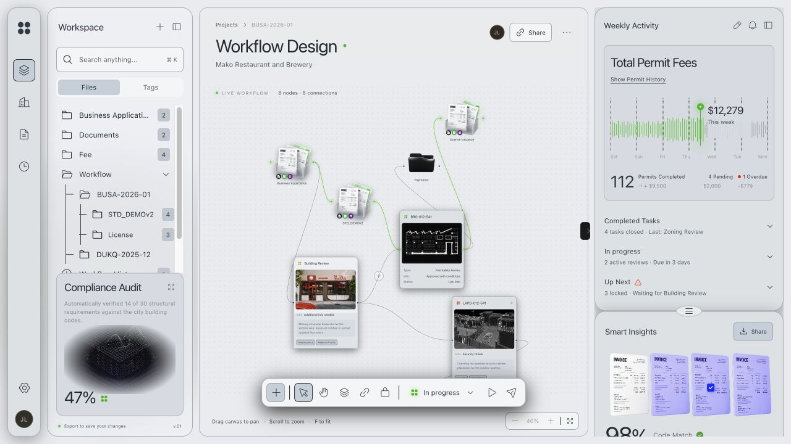

# WGSL 单一源码与 GLSL 生成验证

Audience: public

2026-10-06，本地完成。主光学、主顶点、图像顶点与 blur/downsample/blit 片元现在只维护 WGSL，Naga 30.0.0 在开发构建阶段生成 GLSL ES 300。WebGPU 和 WebGL2 的 JS 资源/API 适配仍分别存在。光学公式仍基于固定 MIT Studio 实现；这轮统一维护和数值契约，没有新增高度场、形状融合或多灯光模型。所有改动未推送、未部署、未发布 npm。

## 当前实现

- 作者源码位于 [src/shaders](../src/shaders/optics.wgsl)，光学库 include 引用固定上游 WGSL；vendor 原件保持不变。运行时不再读取上游 GLSL。
- [构建脚本](../scripts/shaders.mjs) 调用锁定依赖的 [Rust 工具](../tools/shader-translator/src/main.rs)，解析、校验 WGSL，输出 GLSL、纹理绑定、uniform 名称/大小/成员偏移和类型。生成的 JSON 与固定展开 CPU packer 入库；不对生成 GLSL 做人工补丁。
- 顶点转换启用 Naga 坐标调整；光学共享 WGSL 用内部 u_glOrigin 参数适配 frag Y 和折射偏移 Y。GL 保留原有纹理上传行方向。图像 pass 通过原生 fragment 坐标取样。转换器本身不能代替纹理方向和透明合成验证。
- GL 使用反射 uniform block 并在初始化核对活跃成员偏移；光学块 160 bytes，图像块 32 bytes。每个可见表面复用 CPU 数据与 GL buffer 对象，注销/隐藏/销毁清理。WebGPU 使用同一 WGSL layout 和生成 packer。
- 正常 npm ci/build 只检查已生成文件，不要求 Rust、编译器下载或运行时 WASM。改 shader 或工具时运行 npm run shaders:generate。工具仅支持本项目的标量/向量 uniform 契约；WGSL 特性并非全部可转换为 WebGL2。

## 数值与生命周期

基线是本轮开始前的本地第三轮源码，SHA-256 `3d8735402c13f24d901acf12c9c152bfe427f8d1d82afd14af1d9ba1657c7505`；不是已发布 HEAD。最终核心指纹 `e5d574cc22f21762df39fbd2a795259915c9382d5016a19c446bf342ae635d25`。完整基线、原始结果、生成器/fixture 哈希见 [归档 manifest](../benchmarks/results/wgsl-translation/manifest.json)。

84/84 像素案例通过：77 个完全一致，其余颜色通道最大 1/255，alpha 全部精确一致。覆盖 Clear/Frosted/Reading、三种背景、DPR 1/2、薄表面、零 blur/色散、边界参数、缩放 0.2/0.85/2、奇数尺寸 resize、分层与注销。WebGPU/WebGL 之间仍有原基线已有的颜色差异，最大 15/255；单源码不等于两个 API 的像素逐位一致。

稳定 30 帧计数中没有新增 buffer/texture/bind group，WebGPU 的 presentation view 每帧仍创建。四实例（各两种 GPU 后端）、每实例 50 表面、DPR 2 / 600 帧通过资源上界、回调失效/恢复与最终清理。计数只证明可观察对象生命周期，不等于驱动显存或长期稳定性。

## 性能试验与取舍

100 表面、480×280、DPR 1、静态背景，30 帧 warmup + 90 样本，交替顺序三次重复；CPU 提交与 rAF，无 GPU timestamp。下表从每组 270 个原始样本做 nearest-rank 汇总，不平均百分位、不剔除长尾。

| 后端 | CPU mean 基线→当前 (ms) | CPU p95 (ms) | rAF p95 (ms) |
| --- | --- | --- | --- |
| WebGPU | 0.443→0.403 | 0.80→0.70 | 18.4→18.6 |
| WebGL2 | 1.473→1.083 | 2.80→2.50 | 18.2→17.8 |

通用逐字段 packing 循环增加 CPU 成本，改为依据 reflection 生成固定赋值。GL bufferSubData 在一组测量中出现 16.3 ms CPU p95 长尾，改用 STREAM_DRAW bufferData 更新同一个 buffer 对象后复测。该策略可能由驱动替换 backing storage；本轮没有测量其显存成本。最终三次 GL mean 均下降，p95 有一次略升；这些短窗口数据支持本轮没有明显总体回退，不承诺 FPS 或 GPU 加速。两个撤回中间方案的原始数据也保留在归档。

## 消费项目与构建

React Flow 的五后端 × 四种缩放 20/20 再次通过，模型几何、输入和焦点保留。实际生产包先确认 WebGPU / provided，再切换生成 GLSL 的 WebGL：端口连接 8→9，节点拖动改变模型坐标，深浅主题呈现、图片完整、无水平溢出，重置后 8 节点/8 边，控制台无 warning/error，生产 QA 面板移除。截图为 Codex Chromium 154、1280×720、DPR 2 的真实生产预览。



19 个 Node 契约、TypeScript 消费、库/实验室构建、打包安装/无 DOM 导入/React SSR 通过。消费应用 build 与原有 Sites 4/4 通过；JS 707.04 kB / gzip 217.29 kB，仍有单 chunk 超过 500 kB 提示。跨浏览器、长期 soak、真实手机、hydration、GPU 时间和驱动显存仍无本轮证据。

## 复跑与继续

在仓库运行：

```sh
npm ci
npm run shaders:check
npm test
npm run typecheck
npm run build
npm run test:package
node scripts/prepare-wgsl-baseline.mjs
npm run dev
```

打开 /tests/browser/wgsl-quality.html，分别点击像素、性能和 DPR 2 压力按钮，再保存结果 textarea。基线恢复工具验证逐文件哈希，拒绝覆盖不同文件；普通构建无需恢复基线。编辑 WGSL 后的再生成步骤见 [development.md](development.md)。

本轮完成单源码维护；下一阶段可在此基础上逐项比较解析法线/连续倒角或可选高度场模型，先验证视觉和数值，再评估成本。任意 DOM 背景采集是独立能力，不由 shader 转换提供。
